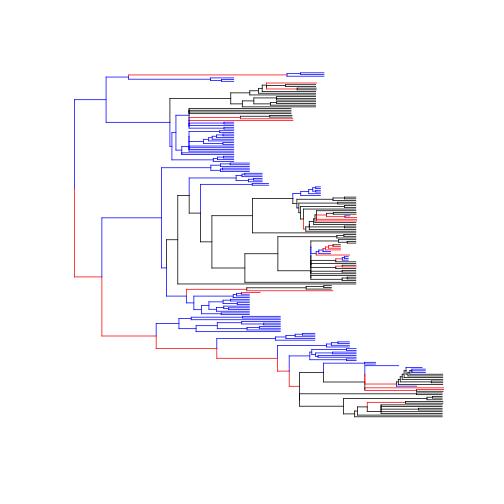

---
output:
  pdf_document:
    fig_height: 10
    fig_width: 5
---


Evolutionary rates analyses in MOTMOT
=====================================

This is a short guide to running evolutionary rates analyses in the ```MOTMOT``` package. The guide conducts the types of analyses described in [Thomas et al. (2006)](http://www.ncbi.nlm.nih.gov/pmc/articles/PMC1634920/) and [Thomas et al. (2009)](http://www.tau.ac.il/lifesci/departments/zoology/members/meiri/documents/Thomasetal2009sizediversificationinAnolis.pdf) to test for variation in rates of phenotypic evolution associated with a discrete explanatory variable. The analyses require a time calibrated phylogeny, a discrete explanatory variable and a continuous response variable. The example below asks whether the rate of evolution of sexual size dimorphism in body mass differs depending on the developmental mode (precocial, intermediate, semiprecocial) of the chicks in shorebirds.

### Getting started
We will start by getting ```MOTMOT``` installed. It is currently only available on github so first we need to load the devtools library.


```r
library(devtools)
install_github("ghthomas/motmot")
```

### Preparing the data
Now we need to load momtot and get the data. We will use a phylogeny of shorebirds and data on development mode and sexual size dimorphism from shorebirds. The data can be accessed from the data folder [here](https://github.com/ghthomas/Comparative-analysis-examples).

For what follows I assume that the phylogeny and data are in a folder called 'data'.


```r
library(motmot)
phy <- read.nexus("data/ShorebirdSupertree.tre")
dat <- read.table("data/ratesdata.txt")
```

The first thing we need to do is reconstruct ancestral states for our discrete explanatory variable. In this case that is developmental mode, here scored as a three level variable. The data and phylogeny have differing sets of species (the data contain a subset of species in the phylogeny) and we need to match them up first. I also ladderized the tree for later plotting purposes - phylogenies are more aesthetically pleasing when ladderized.


```r
phy <- drop.tip(phy, setdiff(phy$tip.label, rownames(dat)))
phy <- ladderize(phy)
```

Next we create a new vector of character states for our explanatory variable


```r
states <- dat[,1]
names(states) <- rownames(dat)
```

Now we are ready to reconstruct ancestral states. There are numerous ways that we could do this for example, similar analyses in phytools split the tree into regimes defined by stochastic character state mapping.. For now we will use the stochastic reconstruction at nodes option from the diversitree package.


```r
library(diversitree)
lik <- make.mkn(phy, states=states, k=3)
transRates <- find.mle(lik, x.init=rep(0.1,6))
set.seed(1) # using set.seed for repeatibility of ASR estimates, in practice it is useful to explore many reconstructions
asrDM <- asr.stoch(lik, transRates$par)
```

The reconstruction from diversitree provides an estimate of the character state at each internal node. We can use this to divide the phylogeny into rate regimes. First we need to assign the estimated ancestral states to node lables in the phylo object.


```r
phy$node.label <- asrDM$node.state
```

Now we can input all of this motmot to prepare the data for analysis.

```r
shorebirdRM <- as.rateMatrix(phy=phy, x="dm", data=dat)
shorebirdRD <- as.rateData(y="ssdmass", x="dm", rateMatrix = shorebirdRM, phy=NULL, data=dat, log.y=FALSE)
```

### Running the rates analyses
The object shorebirdRD contain all of the data bundled up and ready to run. We will start with the most complex model. Here each category for developmentmal mode can have its own rate of evolution and its own mean value for the response variable (sexual size dimorphism in body mass). The command ```fixed``` is used to determine which states of the explanatory variable have rates estimated and which have rates that are fixed for the response. I recommend always fixing at least one rate. You can do this by setting TRUE or by entering a numeric value. If you enter a value, this will be used to determine the relative rate in the fixed state. In practice, the choice of which state to fix is not important because rates are reported as relative rather than absolute values. In the first example we fixed the rate for state 1 (species with precocial developmental mode) and estimate rates for the other two states (2=ambiguous development and 3=semiprecocial development).


```r
ML.RatePhylo(shorebirdRD, fixed=c(TRUE,FALSE,FALSE))
```

```
## ____________________________
## Maximum likelihood estimation: rates:
## 
## Lambda:           0.8013 
## Brownian variance (rate):  0.0002098 
## ML estimates of group relative rates :           1 1.019 0.4381 
## Lower confidence intervals for rates: NA 
## Upper confidence intervals for rates: NA 
## ML estimates of group means :  -0.03766 0.04332 -0.00169 
## 
## Number of parameters:  7 
## Maximised log likelihood:  262.4 
##   AIC =  -510.7   
##   AICc =  -510   
## 
## ____________________________
## Comparison with single rate model
## Lambda (single rate model):           0.803 
## Log likelihood (single rate):  256.7 
## LR statistic (ML rates vs single rate): 11.35  P =  0.003423 df =  2  
##   Single rate AIC =  -505.4   
##   Single rate AICc =  -505.1   
## ____________________________
```

The table below gives a brief descritpion of the model output. The conclusions that we can draw from the model output here is that rates differ among groups. Specifically, the rate of evolution of sexual size dimorphism is faster (a little more than twice as fast) among precocial taxa than semiprecocial or intermediate data.

|  Output  |  description  |  
|:------|:------------|
|Lambda    |Estimate of Pagel's lambda          |
|Brownian variance (rate)     |Absolute rate of phenotypic evolution for the fixed state          |
|Lower confidence intervals for rates     |Approximate lower confidence interval for each rate          |
|Upper confidence intervals for rates     |Approximate upper confidence interval for each rate           |
|ML estimates of group means     |Estimates of the mean value for the continuous variable in each state          |
|Number of parameters     |Parameters estimated in the model (includes rates, means and Pagel's lambda)          |
|Maximised log likelihood     |ML estimate for the model          |
|AIC     |Model AIC           |
|AICc     |Model small-sample AIC          |
|Lambda (single rate model)     |Estimate of Pagel's lambda for a model with all rates equal          |
|Log likelihood (single rate)     |ML estimate for the model with all rates equal           |
|LR statistic (ML rates vs single rate)     |Likelihood ratio test comparing the all rates equal model with the fitted model          |
|Single rate AIC     |Single rate AIC          |
|Single rate AICc     |Single rate small-sample AIC          |


In the first example we allowed the mean value for sexual size dimorphism to differ among states. My personal view is that this is always a sensible thing to do, but we can test whether means differ while also allowing rates to differ. This is not hugely different from some of the models in the ```ouwie``` package that fit OU models with variable rates except that here we do not estimate the alpha parameter of the OU model.


```r
ML.RatePhylo(shorebirdRD, fixed=c(TRUE,FALSE,FALSE), common.mean=TRUE)
```

```
## ____________________________
## Maximum likelihood estimation: rates:
## 
## Lambda:           0.8483 
## Brownian variance (rate):  0.000191 
## ML estimates of group relative rates :           1 1.708 0.5069 
## Lower confidence intervals for rates: NA 
## Upper confidence intervals for rates: NA 
## ML estimates of group means :  -0.01134 
## 
## Number of parameters:  5 
## Maximised log likelihood:  258.8 
##   AIC =  -507.7   
##   AICc =  -507.3   
## 
## ____________________________
## Comparison with single rate model
## Lambda (single rate model):           0.8092 
## Log likelihood (single rate):  251.6 
## LR statistic (ML rates vs single rate): 14.5  P =  0.0007091 df =  2  
##   Single rate AIC =  -499.1   
##   Single rate AICc =  -499.1   
## ____________________________
```

Now that we fix the mean value for SSD to be equal, we get some slightly odd results. The model AIC values are lower when we don't allow different means, suggesting that means do differ among states. If we were to ignore that then we might conclude that the highest rates are among taxa with intermediate developmental modes. We should be cautious with such a conclusion because only seven species have intermediate developmental mode. With such a low sample size rates are not estimated reliably and will likely have large confidence intervals. As a rule of thumb, there should be at least 20 species to each character state, although exactly how a model behaves depends also on the overall proportions of species in each state and the shape of the phylogeny. If we ignore the intermediate species, we still find evidence that rates of evolution are higher among precocial than semiprecocial taxa.

It can be useful to visualise the outcome of the rates models by stretching or compressing the branch lengths of the phylogeny. This is a crude first pass at a function to do this. It simply stretches the branches by their relative rate and colours them according to state. The user specifies the colours and it is all passed to ape's plot.phylo function. It would be better if it could the output from ML.RatePhylo only, rather than needing the tree as well and also if it wasn't necessary to specify pretty=FALSE (i.e. I need to modify the output from ML.RatePhylo). Anyway, here is the function.


```r
plotTransTree <- function(phy, fit, col.state="black", ...) {
  states <- sort(unique(phy$node.label))
	col <- rep(NA, Nnode(phy))
	for (i in 1:length(states)) {
		phy$edge.length[phy$node.label==states[i]] <- phy$edge.length[phy$node.label==states[i]] * fit$MLRate[i]
		col[phy$node.label==states[i]] <- col.state[i]	
		}
		plot.phylo(phy, edge.color=col, ...)
		return(phy)
		}
```

And here is an example>


```r
model.fit <- ML.RatePhylo(shorebirdRD, fixed=c(TRUE,FALSE,FALSE), common.mean=FALSE, pretty=FALSE)

phy2<- plotTransTree(phy, model.fit, col.state=c("black", "red", "blue"), show.tip.label=FALSE)
```

 


